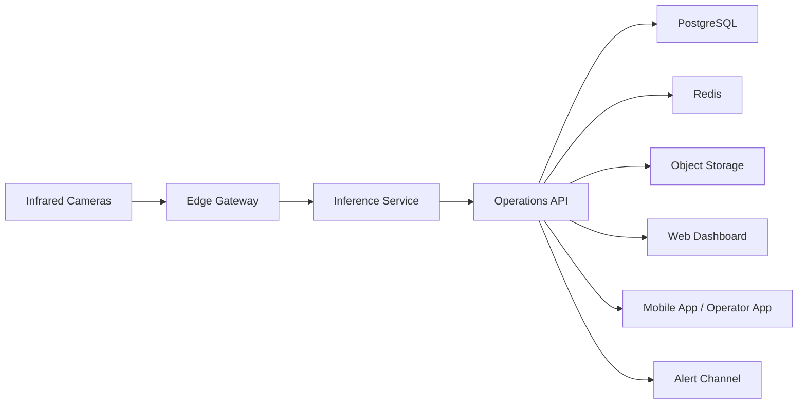

# 적외선 카메라 기반 컴퓨터비전 서비스 패키징

## 서비스 개요

본 서비스는 적외선 카메라를 활용해 물류센터와 도로 환경의 사람, 차량, 지게차, 장애물, 위험구역 침범 상황을 실시간으로 감지하고, 이를 운영자 앱과 관제 대시보드로 전달하는 현장 적용형 안전관제 솔루션이다. 핵심 목표는 저조도 또는 야간 환경에서도 안정적인 위험 감지와 즉시 대응이 가능하도록 만드는 것이다.

서비스는 단순 영상 인식 프로젝트가 아니라 `현장 단말 -> AI 추론 -> 운영 서버 -> 사용자 앱`으로 이어지는 전체 서비스 구조로 패키징한다. 이를 통해 데모 수준을 넘어 실제 운영을 위한 가상화, 데이터 저장, 이벤트 관리, 앱 제공까지 하나의 제품처럼 설명할 수 있다.

## 적용 시나리오

### 물류센터

- 지게차와 작업자 간 접근 위험 감지
- 출입 제한 구역 침범 감지
- 야간 적재장 및 이동 동선 모니터링
- 적재 구역 내 방치물 또는 돌발 장애물 감지

### 도로 및 외부 현장

- 야간 보행자 탐지
- 공사구간 장애물 및 비정상 정차 차량 감지
- 저시야 구간 위험 객체 경고
- 통제 구역 진입 감지 및 관제 알림

## 서비스 계층 구조

### 1. 현장 수집 계층

적외선 카메라와 엣지 장비가 현장 영상을 수집한다. 현장 단말은 프레임 수집, 기본 전처리, 카메라 상태 확인, 네트워크 연결 유지까지 담당한다.

**주요 기능**

- 적외선 영상 스트리밍 수집
- 카메라 장비 ID와 위치정보 관리
- 프레임 샘플링 및 기본 전처리
- 장비 상태 정보와 헬스체크 전송

### 2. AI 분석 계층

적외선 영상을 기반으로 사람, 차량, 지게차, 장애물, 위험구역 침범 여부를 분석한다. 물류와 도로 시나리오에 따라 탐지 대상과 판단 규칙을 다르게 적용할 수 있어야 한다.

**주요 기능**

- 객체 탐지
- 위험구역 침범 판정
- 거리 또는 근접 위험 계산
- 이벤트 등급화
- 저조도 환경 보정

### 3. 서비스 운영 계층

이벤트 저장, 알림 전송, 사용자 권한 관리, 운영 규칙 관리, 보고서 생성을 담당한다. 현장용 앱과 대시보드에 동일한 이벤트를 안정적으로 전달하기 위해 API 중심 구조로 설계한다.

**주요 기능**

- 이벤트 저장과 검색
- 위험 알림 발송
- 현장, 카메라, 사용자, 권한 관리
- 통계 집계와 리포트 생성
- 운영 정책 관리

### 4. 사용자 앱 계층

모바일 앱과 웹 대시보드를 포함한다. 모바일 앱은 실시간 대응에, 웹은 관제와 통계 관리에 초점을 맞춘다.

**주요 기능**

- 실시간 경고 수신
- 카메라별 현황 조회
- 이벤트 상세 확인
- 대응 상태 기록
- 관리자용 통계 및 리포트 확인

## 가상화 아키텍처

서비스는 현장 장비, 중앙 추론 서버, 운영 API, 저장소, 프런트엔드가 분리된 구조로 가상화한다. 실환경에서는 물류센터 내부망 또는 도로 관제센터의 폐쇄망에 맞춰 엣지 노드와 중앙 서버를 나누는 구성이 적합하다.



## 가상화 대상 서비스

### Edge Gateway

현장 카메라와 직접 연결되는 서비스다. 적외선 프레임 수집, 전처리, 장비 상태 수집, 중앙 서버 전송을 담당한다.

### Inference Service

컴퓨터비전 모델 추론을 담당하는 서비스다. GPU 또는 고성능 장비에 배치해 객체 탐지와 위험 판정을 처리한다.

### Operations API

운영 중심 백엔드 서비스다. 이벤트 저장, 사용자 인증, 알림 전송, 정책 적용, 대시보드용 API를 제공한다.

### Redis

실시간 이벤트 큐, 캐시, 최근 경고 상태 저장에 활용한다.

### PostgreSQL

장비 정보, 사용자 정보, 이벤트 로그, 대응 이력, 통계 원본 데이터를 저장한다.

### Object Storage

이벤트 캡처 이미지, 짧은 영상 클립, 리포트 파일을 저장한다.

### Web Dashboard

관리자와 안전 담당자가 웹에서 실시간 상태와 통계를 확인하는 프런트엔드다.

## 최종 앱 구성

### 운영자 모바일 앱

- 위험 알림 푸시 수신
- 이벤트 상세 확인
- 현장 위치별 위험 확인
- 처리 상태 등록
- 근무자별 대응 이력 조회

### 관리자 웹 대시보드

- 실시간 카메라 상태판
- 위험 이벤트 리스트
- 카메라별 최근 경고 히스토리
- 현장 맵 기반 구역 표시
- 일일, 주간, 월간 리포트
- 현장별 정책 설정

## 주요 화면 패키지

1. 로그인 및 권한 선택 화면
2. 실시간 모니터링 화면
3. 이벤트 목록 화면
4. 이벤트 상세 화면
5. 카메라 관리 화면
6. 현장 맵 화면
7. 통계 및 리포트 화면
8. 정책 및 알림 설정 화면

## 기능별 앱 화면 와이어프레임 제안

아래 화면은 운영자 모바일 앱 기준으로 우선 제안하는 핵심 화면이다. 실제 제안서나 발표자료에는 와이어프레임 수준으로 먼저 제시한 뒤, 이후 시각 디자인 단계에서 색상과 아이콘 체계를 입히는 방식이 적합하다.

### 1. 실시간 모니터링 및 위험 알림 화면

**목적**

- 현재 현장 상태를 한눈에 보여준다.
- 위험 이벤트가 발생했을 때 운영자가 즉시 인지하고 대응할 수 있도록 한다.

**핵심 기능**

- 실시간 카메라 영상 확인
- 최근 위험 이벤트 확인
- 위험도 등급별 상태 표시
- 긴급 조치 버튼 제공

**와이어프레임**

```text
+--------------------------------------------------+
| [로고] 현장 실시간 모니터링            [알림][메뉴] |
+--------------------------------------------------+
| 현장: 물류센터 A동      카메라: CAM-03            |
| 상태: 정상 / 위험 / 긴급                           |
+--------------------------------------------------+
|                                                  |
|              [ 실시간 적외선 영상 ]               |
|                                                  |
|      사람 2명 / 지게차 1대 / 위험구역 접근        |
|                                                  |
+--------------------------------------------------+
| 위험 요약                                         |
| - 충돌주의: 작업자와 지게차 거리 2.1m             |
| - 구역침범: 제한구역 내 작업자 진입 감지          |
+--------------------------------------------------+
| [경고방송] [현장통화] [이벤트상세] [긴급정지요청] |
+--------------------------------------------------+
| 홈            이벤트           카메라            설정 |
+--------------------------------------------------+
```

**구성 포인트**

- 상단에는 현장명, 카메라 ID, 위험 상태를 고정 표시한다.
- 중앙은 영상 중심으로 두고, 하단에 위험 요약과 즉시 대응 버튼을 배치한다.
- 모바일 환경에서는 조작보다 인지가 우선이므로 버튼 수를 4개 이내로 제한한다.

### 2. 이벤트 상세 및 대응 처리 화면

**목적**

- 발생한 이벤트의 세부 내용을 확인하고 대응 상태를 기록한다.
- 추후 관리자 보고와 사고 이력 관리에 활용한다.

**핵심 기능**

- 이벤트 이미지 또는 영상 확인
- 발생 시간, 위치, 객체, 위험유형 확인
- 담당자 조치 상태 기록
- 메모와 후속조치 입력

**와이어프레임**

```text
+--------------------------------------------------+
| [뒤로가기] 이벤트 상세                            |
+--------------------------------------------------+
| 이벤트 ID: EVT-20260327-014                      |
| 위험등급: HIGH                                   |
| 발생시간: 2026-03-27 21:14                       |
| 위치: 물류센터 A동 / 하역구역                     |
+--------------------------------------------------+
|            [ 캡처 이미지 또는 영상 썸네일 ]        |
+--------------------------------------------------+
| 객체 유형: 작업자 / 지게차                        |
| 위험 유형: 충돌주의                               |
| 카메라 ID: CAM-03                                 |
| 상태: 미조치 / 조치중 / 조치완료                  |
+--------------------------------------------------+
| 대응 메모                                         |
| [ 작업자 이동 조치 및 지게차 속도 제한 안내 ]     |
+--------------------------------------------------+
| [조치중 변경] [조치완료] [담당자 호출] [리포트저장]|
+--------------------------------------------------+
```

**구성 포인트**

- 이벤트 식별 정보와 증빙 이미지를 화면 상단에 배치해 판단 속도를 높인다.
- 하단 액션은 `조치중`, `조치완료`처럼 운영 흐름에 맞는 상태 전이 중심으로 설계한다.
- 추후 관리자 웹과 연동할 때 동일한 이벤트 ID 체계를 사용하면 이력 추적이 쉬워진다.

## 추가 확장 화면 제안

필요 시 다음 화면으로 확장할 수 있다.

- 카메라 상태 관리 화면
- 현장 맵 기반 위험구역 표시 화면
- 일일 위험 통계 및 리포트 화면
- 관리자 정책 설정 화면

## 데이터 모델 패키지

### Camera

- camera_id
- site_id
- zone_name
- device_type
- status
- last_seen_at

### Event

- event_id
- occurred_at
- camera_id
- object_type
- risk_type
- risk_level
- image_url
- clip_url
- acknowledged
- acknowledged_by

### Site

- site_id
- site_name
- site_type
- address
- operational_policy

## 운영 패키지

### 로그 및 감사

- 카메라 연결 실패 로그
- 추론 실패 로그
- 알림 전송 이력
- 사용자 조치 이력

### 보안

- 관리자와 운영자 권한 분리
- API 토큰 또는 OAuth 기반 인증
- 내부망 우선 배포
- 저장 영상 접근 제어

### 확장성

- 카메라 수 증가에 따른 추론 서비스 수평 확장
- 현장별 정책 분리
- 물류센터와 도로 시나리오별 탐지 모델 분리 운영

## 릴리스 패키지 구성

최종 패키지는 아래 단위로 설명하고 배포한다.

1. 엣지 수집 모듈
2. AI 추론 서비스
3. 운영 API 서버
4. 저장소와 캐시 인프라
5. 웹 대시보드
6. 모바일 앱 또는 모바일 웹
7. 운영 가이드와 장애 대응 문서

## 제안서용 요약 문구

적외선 카메라 기반 컴퓨터비전 기술을 활용하여 물류센터 및 도로 환경의 사람, 차량, 장애물, 위험구역 침범 상황을 실시간으로 인식하고, 이를 엣지 장비, AI 분석 서버, 운영 API, 관리자 대시보드, 운영자 앱으로 구성된 가상화 서비스 구조로 패키징하여 실제 현장 적용이 가능한 안전관제 앱 서비스로 구현한다.
